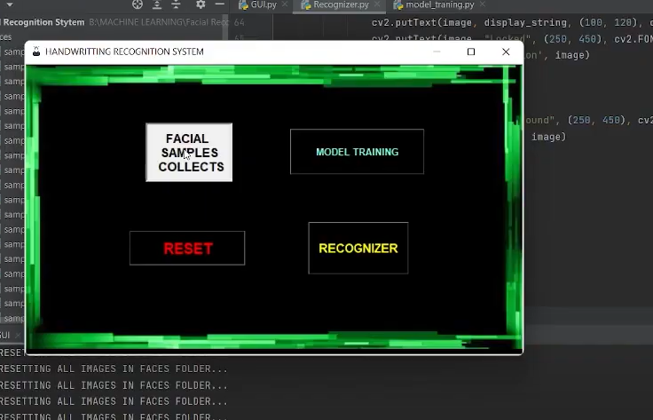
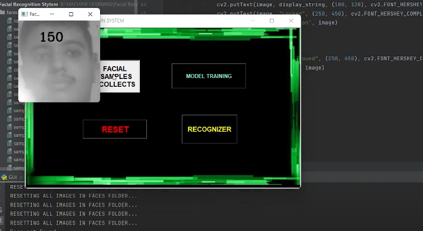
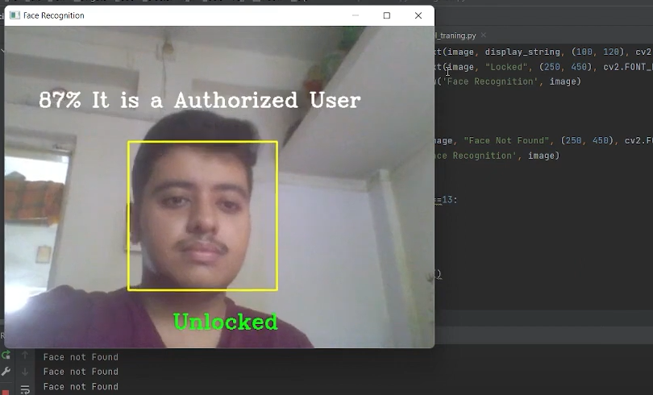
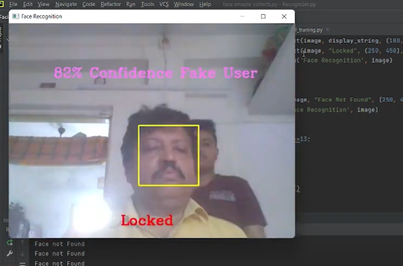

# FACIAL AUTHENTICATION SYSTEM :star_struck: 

[](https://shields.io/) [](https://shields.io/) [](https://shields.io/) [](https://shields.io/) [](https://shields.io/) [](https://shields.io/) 
<br>

***This new Facial Authentcation System using AIML is created by Biswarup Bhattacharjee, student of BTECH, in University of Engineering and Management, Kolkata.***

**Email Id: bbiswa471@gmail.com.** 

**Contact No: 916290272740.** 


<p align="left">
<a href="https://www.facebook.com/profile.php?id=100070395300810" target="blank"></a>
<a href="https://instagram.com/biswarup2210" target="blank"></a>
<a href="https://github.com/biswa2210/biswa2210" target="blank"></a>
</p>

## About :point_down: 

</div align="justified">

**This is a software or program which matches a face with a given face dataset. When user takes his face before the camera if the face matches with the given face or not that is shown** It shows appropiate and correct result. A facial recognition system is a technology capable of matching a human face from a digital image or a video frame against a database of faces. When we start the application it takes our many images for dataset. It is for the first time then it matches with the face it detects from webcam using opencv. It showss the match in percentage.
</div>

## FACIAL AUTHENTICATION DEMO VIDEO: :point_right: <a href="https://www.youtube.com/watch?v=AHu06hhGCR0&list=PL0lbDlMJ1h4jrRuH-A6njkMA3iYmRhxIO&index=3">Click here to watch</a>

## AIML-DL PLAYLIST: :point_right: <a href="https://www.youtube.com/watch?v=K0AAxrbzLFg&list=PL0lbDlMJ1h4jrRuH-A6njkMA3iYmRhxIO">Click here to watch</a>

## The Software uses :point_down:
 - [x] open Computer vision through web camera

## Folder Structure :point_down:

```bash
FACIAL AUTHENTICATION SYSTEM
     ├── GUI.py
     ├── Recognizer.py
     ├── face_smaple_collects
     └── model_training.py

```                       

## Screenshots :point_down: 

<div align="center">

<a href="pics/face.png"></a> <a href="pics/face1.png"></a>

<a href="pics/face2.png"></a> <a href="pics/face3.png"></a>


</div>


